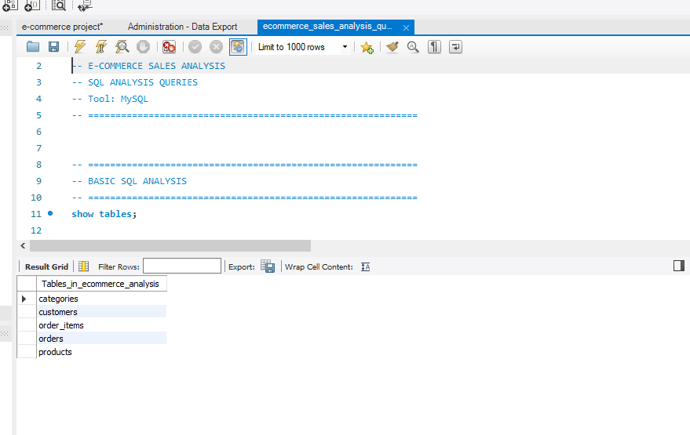
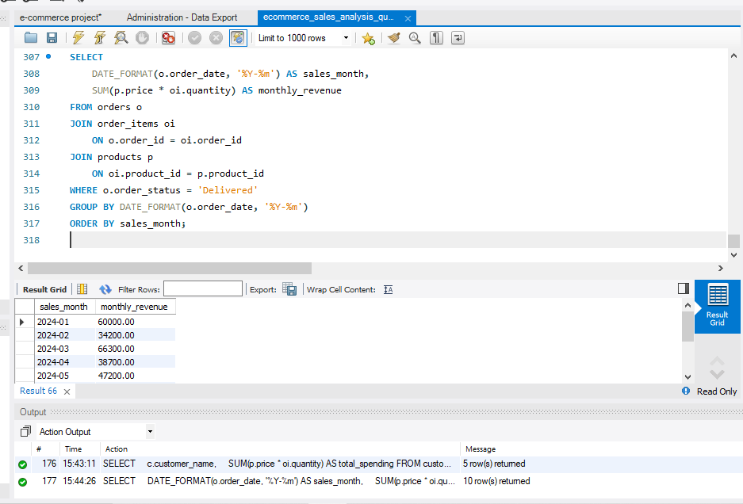
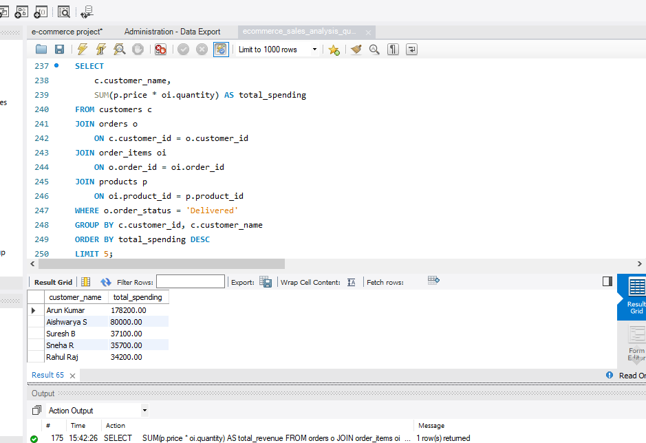
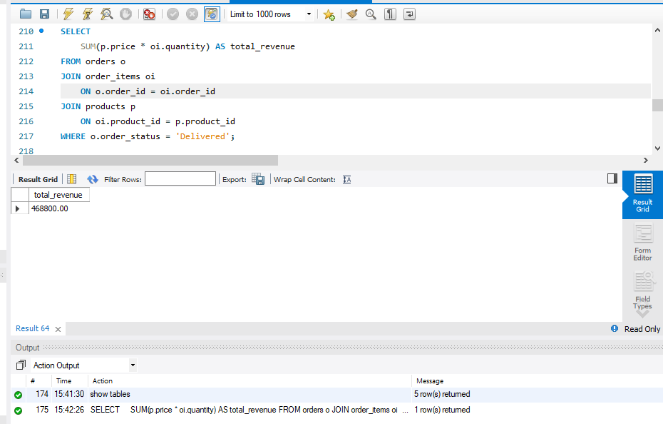

# 🛒 E-Commerce Sales Analysis using MySQL

## 📌 Project Overview

This project analyzes e-commerce sales data using **MySQL and SQL**.

The objective is to analyze customer orders, product sales, revenue, and purchasing patterns using SQL queries and generate meaningful business insights.

---

## 🎯 Project Objectives

- Analyze overall e-commerce sales performance
- Calculate total revenue from delivered orders
- Identify top customers based on total spending
- Analyze monthly revenue trends
- Analyze product and category performance
- Practice SQL joins, aggregate functions, filtering, grouping, sorting, and subqueries
- Answer real-world business questions using SQL

---

## 🗄️ Database Structure

The project database contains the following tables:

- Customers
- Orders
- Order Items
- Products
- Categories

These tables are connected using primary keys and foreign keys to analyze customers, orders, products, and sales.

---

## 🛠️ Tools & Technologies

- **MySQL**
- **MySQL Workbench**
- **SQL**
- Joins
- Aggregate Functions
- GROUP BY
- ORDER BY
- WHERE
- CASE
- Subqueries

---

## 🔍 Analysis Performed

The project contains **30 SQL business questions**, including:

- Total revenue calculation
- Order analysis
- Customer spending analysis
- Top customers
- Product sales analysis
- Category-wise analysis
- Monthly revenue analysis
- Delivered-order analysis
- Ranking and sorting
- Conditional analysis using CASE
- SQL subqueries
- Multiple-table JOIN operations

---

## 📊 Key Analysis

### Total Revenue

Calculated the total revenue generated from delivered orders using:

`Product Price × Order Quantity`

### Top Customers

Identified customers with the highest total spending based on their delivered orders.

### Monthly Revenue

Analyzed revenue generated across different months to understand sales trends.

### Product & Category Analysis

Analyzed product-level and category-level sales performance to identify important contributors to revenue.

---

## 📸 Project Visualizations

### Database Tables

### Monthly Revenue

### Top Customers

### Total Revenue

---

## 📁 Project Files

- [ecommerce_sales_analysis-sql.sql](ecommerce_sales_analysis-sql.sql)

Contains the database creation, table creation, and data-related SQL statements.

- [ecommerce_sales_analysis_queries.sql](ecommerce_sales_analysis_queries.sql)

Contains the 30 SQL queries used for the analysis and business questions.

### Screenshots

The screenshots demonstrate the database tables and selected analysis results.

---

## 💡 Key Skills Demonstrated

- SQL Data Analysis
- MySQL
- Database Management
- Data Aggregation
- Data Filtering
- Multi-table Joins
- Subqueries
- Business Question Analysis
- Revenue Analysis
- Customer Analysis

---

## 📌 Conclusion

This project demonstrates how SQL can be used to transform e-commerce transactional data into meaningful business insights. The analysis focuses on revenue, customers, products, categories, and sales trends using practical SQL techniques.
